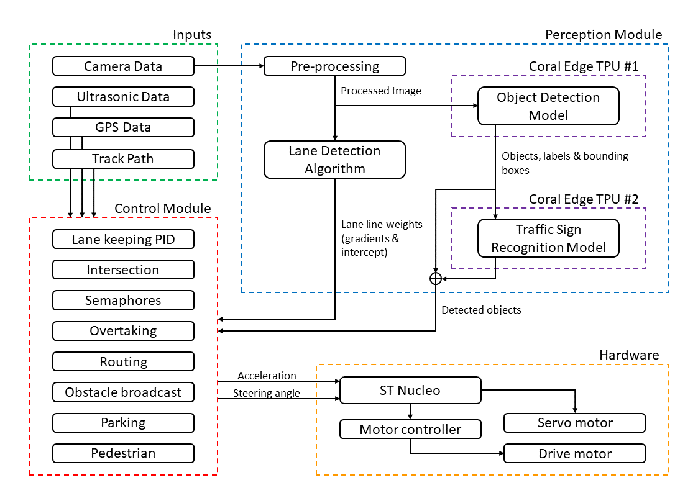

# Bosch Future Mobility Challenge - Team Drive UM

---
This repository contains the code which will run on the Raspberry Pi that controls a 1:10 scale model car. The car will need to drive autonomously round a track and handle various scenarios as mentioned in the [BFMC 2021 guidelines](https://boschfuturemobility.com/wp-content/uploads/2020/12/BoschFutureMobilityChallenge_Regulations_2021.pdf). The key tasks are implemented in Python and make use of multithreading/multiprocessing, together with a system of pipes. This will allow the workers to run concurrently, which should make the system operate more efficiently.

## System Modules

---
| Process | Input | Output |
| ----------- | ----------- | ----------- |
| Lane Detection | Camera image | Gradients and intercepts of the detected lines (aka lane vector) |
| Object Detection | Camera image | Locations, bounding boxes and classes of the detected objects (aka object vector) |
| Camera Publisher | None | Camera image |
| Path Planner | XML Graph, GPS | Path plan |
| Controller | Lane vector, object vector and path plan | Nucleo commands (speed, steering angle, etc.) |
| Nucleo Interface | Nucleo Commands | Serialised message (this is directly sent to the Nucleo) |
| Communicator (GPS Handler, Object Handler) | GPS (raw), object vector | GPS and send location of objects to server |
| Ultrasonic (currently optional, but would have a similar thread to Camera Publisher) | None | Distance to object |

## General System Overview

---
